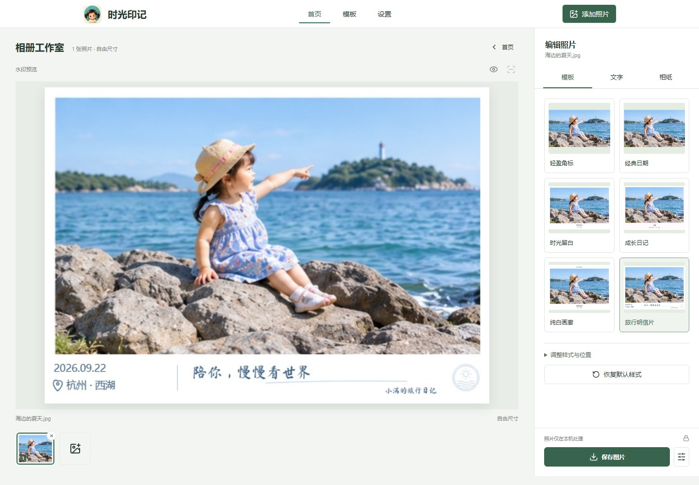
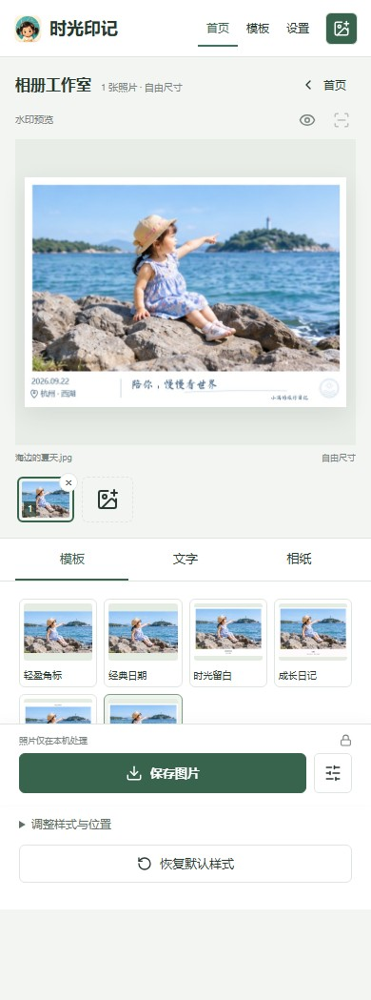

<p align="center"></p>

# 时光印记

**免费给宝宝照片添加时间、地点水印。**

一个无需注册、无需后端的照片水印网站。读取照片中的 EXIF 拍摄时间和 GPS，在浏览器本地编辑、预览并导出，让日常照片留下成长记录。


## 功能

- 六款模板：轻盈角标、经典日期、时光留白、成长日记、纯白画廊、旅行明信片。
- 自定义时间、地点、坐标、宝宝月龄与事件文字；明信片支持手写寄语、落款和邮戳。
- 本地近似省市匹配；记住用户手动填写的地点。可选联网解析，默认不启用。
- 字号、颜色、透明度、位置调整，以及一键恢复当前模板的默认样式。
- JPEG / PNG、批量 ZIP、PDF 导出；支持原图比例及 3 / 5 / 6 寸尺寸适配。
- 适配电脑、iPhone Safari 和安卓浏览器；iPhone 提供系统分享、长按保存路径。
- 支持添加到主屏幕。无需数据库、账号或照片上传服务。

> 浏览器不能静默写入 iPhone 相册，需要用户在系统分享菜单中保存，或长按生成的图片。手机局域网 HTTP 测试不支持完整的系统分享能力。

## 效果预览




<p></p>

演示使用项目内的合成示例素材。页面截图来自实际运行的应用，模板图由当前水印引擎生成，不是概念设计稿。手机截图为浏览器尺寸模拟，不代表 iOS 真机验收。

## 本地启动

需要 Node.js 22 或更新版本，以及 npm。

```bash
git clone https://github.com/maxiaobang7/TIME-IMPRINT.git
cd TIME-IMPRINT
npm ci
npm run dev -- --port 5182
```

电脑访问 `http://localhost:5182/`。手机与电脑连接同一 Wi-Fi，访问 `http://电脑局域网IP:5182/`，并允许防火墙的专用网络访问。不要把开发服务器端口开放到公网。

## 测试和部署

```bash
npm test
npm run build
npm run preview -- --port 5183
```

将 `dist/` 的内容部署到静态网站的**域名根目录**，启用 HTTPS。无需服务器端业务程序。当前图标、字体、示例图和 Service Worker 使用根路径，不直接支持 GitHub Pages 的 `/TIME-IMPRINT/` 子目录部署。

Vercel / Netlify 等平台可配置构建命令 `npm run build`、输出目录 `dist`。仓库同步不等于网站已部署。

详见 [使用说明](docs/USER_GUIDE.md)、[部署与开发](docs/DEVELOPMENT.md)、[隐私说明](docs/PRIVACY.md)、[第三方资源说明](docs/THIRD_PARTY_NOTICES.md)。

## 项目结构

```text
src/                  React 页面、模板、水印渲染、EXIF 与地点处理
public/               图标、字体、示例素材、PWA 清单与 Service Worker
Tests/                自动化测试与非个人测试图片
scripts/              可复现的演示图生成脚本
docs/                 使用说明、开发说明、效果截图
.github/workflows/    Linux 安装、测试和构建检查
```

## 演示图再生成

首次安装浏览器后运行：

```bash
npx playwright install chromium
npm run demo
```

脚本自动启动临时本地 Vite 服务，输出截图和六款模板成品至 `docs/screenshots/`，完成后关闭服务与浏览器。

## 边界

- EXIF 不一定存在。聊天软件转发、截图或系统转换可能移除拍摄时间和 GPS；可以手动补填。
- 离线省市来自精简城市中心坐标表的最近邻匹配，不是行政区边界判断，也不是精确街道地址。
- 大批量高分辨率照片和 HEIC 转码较耗内存；手机上建议分批处理。
- 本项目不包含直接打印功能。尺寸适配与 PDF 导出仍保留。
- 尚未指定开源许可证；公开源码不等同于授予任意商用或再分发许可。第三方组件与字体遵循各自许可证。
